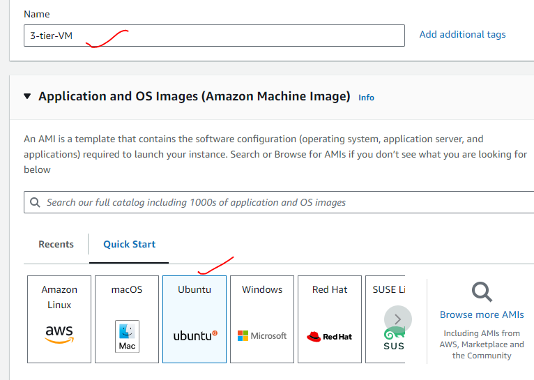
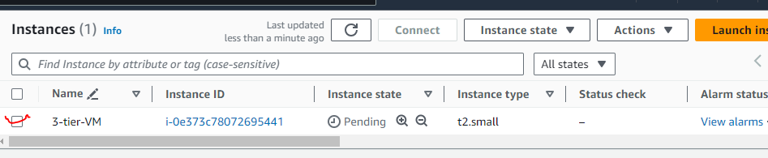
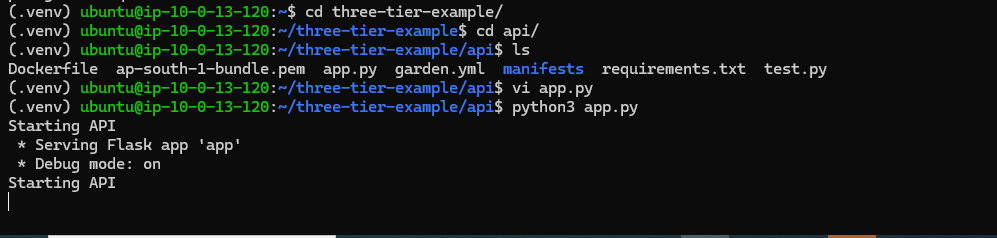
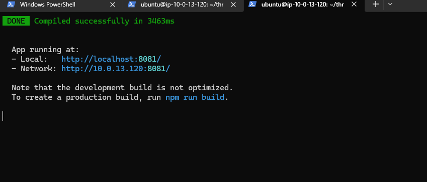

To deploy three-tier python application
----------------------------------------

* The project is a simplified version of the microservice voting application 

The project has the following components:
- web - A frontend Vue application
- api - A Python API server
- db - A Postgres database

* Steps to create PostgreSQL using AWS cloud


* Database is created


* Steps to create virtual machine



* VM created


* lets ssh into the machine
* clone the application https://LearningThoughtsEdu@dev.azure.com/LearningThoughtsEdu/Batch-1/_git/three-tier-example
* Check if python is available, if not install by using below commands.
```
sudo apt update
sudo apt install python3
python3 --version
``` 


* Install python pip packages using the below command. Installing pip is crucial for Python development as it provides a powerful and flexible way to manage Python packages. It simplifies the installation process, supports Python 3, handles dependencies automatically, and integrates well with virtual environments, making it an essential tool for any Python developer.

```sudo apt install python3-pip -y```

#### Lets create a virtual environment

* Install the venv Module

```sudo apt install python3.12-venv```

* Create a Virtual Environment

```python3 -m venv .venv```

* Activate the Virtual Environment 

```source .venv/bin/activate```

 
```sudo apt-get install -y python3-dev libpq-dev```

1. **`python3-dev`**: This package provides the header files and a static library for Python 3. It is required when you need to build Python modules that rely on the Python/C API, such as when installing certain Python packages that include C extensions. Without `python3-dev`, you may encounter errors when trying to install these packages.

2. **`libpq-dev`**: This package provides the header files and a static library for the PostgreSQL database server. It is required when you need to build applications that interface with a PostgreSQL database using the libpq library, such as when installing the Python package for PostgreSQL, `psycopg2`. Without `libpq-dev`, you may encounter errors when trying to install packages that depend on the PostgreSQL client library.

* Login to the database and create a table

```psql --host=<databse_end_point> --dbname=postgres --username=postgres```

* Give password and create table

```CREATE TABLE IF NOT EXISTS votes (id VARCHAR(255) NOT NULL UNIQUE, vote VARCHAR(255) NOT NULL, created_at TIMESTAMP DEFAULT NULL);```


* Now get inside the three-tier-example\api folder and open app.py file and update Database credentials.

db_hostname = os.getenv('PGHOSTNAME', '<dabase_endpoint>')
db_database = os.getenv('PGDATABASE', '<dabase_name>')
db_password = os.getenv('PGPASSWORD', '<database_password>')
db_user = os.getenv('PGUSER', '<dabase_username>')

* Get into the folder three-tier-example\api and run the below command to install all the dependencies.
```pip3 install -r requirements.txt```

* Install the NVM (Node Version Manager) using below or download from website https://github.com/nvm-sh/nvm

```curl -o- https://raw.githubusercontent.com/nvm-sh/nvm/v0.39.1/install.sh | bash```

* Exit and re loginto the machine or use command ```source ~/.bashrc```
* Run the below commands to install nvm and npm
```
nvm install 
npm install 
```


* To run the API service ```python app.py```


* To launch the WEB application ```npm run serve```

* To access the application ```http://public_ip_addr:8081```


