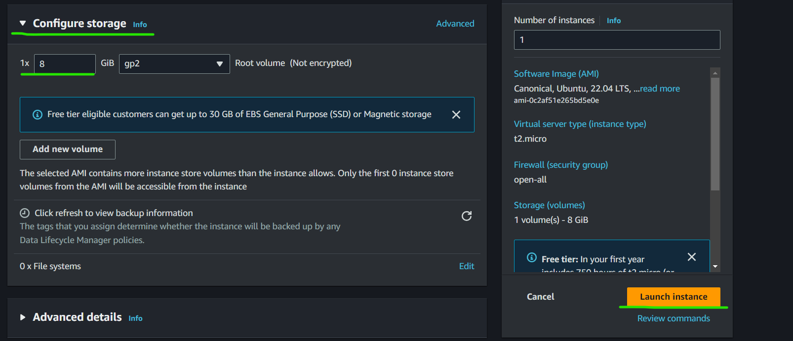

# Instruction to run the application on single VM (Virtual Machine)

* For Running the application you need
    1. **PostgreSQL Database** to be configured in **AWS cloud** and should be in the **Mumbai** region only
    2. Python to be installed on VM
    3. NodeJs Version 10

## Creating PostgreSQL Database in AWS

### Follow below steps to create the database

* Search for RDS service in AWS console in Mumbai region

  

  

* Select Standard Create and PostgreSQL

  

* Select PostgreSQL Engine Version and for now select Free tier as a Template

  

* In Settings section provide your Database instance identifier name
* Also create your credentials for Master user
  * provide master username
* Select Self managed for password creation
  * provide password for master user

  

* Select the Instance configuration as per requirement as for now select `db.t3.micro` 

  

* Select storage type and storage allocation as per requirement

  

* In Connectivity
  * select your Virtual Private Cloud (VPC)
  * select DB subnet group
  * for now select **Public access** as **Yes**
  * select security group which has required permissions

    

    
  
* Now Create database

  

  

## Creating Virtual Machine to host the application

* Now Select EC2 service and then Launch Instance


* Give your instance name
* Select Application and OS Image (Amazon Machine Image)


* Select instance type and key pair for login to that instance


* In Network Settings select your Network and Security Group which having proper permissions


* Now select the storage configuration as per requirement and Lunch the instance



* Now login to the Virtual machine


## Install the Necessary Software for running the application

Here we are using the Ubuntu machine so with the this we get the `Python` pre-installed.

* As part of installation start with updating packages, use below command
```bash
sudo apt update
```
* Check python version
```bash
python3 --version
```


* Install the python pip package
```bash
sudo apt install python3-pip -y
```
* Now install the binary required to run the appliction
```bash
sudo apt-get install -y python3-dev libpq-dev
```
* Install the NVM (Node Version Manager)
```bash
curl -o- https://raw.githubusercontent.com/nvm-sh/nvm/v0.39.1/install.sh | bash
```
Make sure to check for the latest version of NVM on its [GitHubRepository](https://github.com/nvm-sh/nvm) and replace v0.39.1 with the latest version if necessary.

* Activate NVM : After the installation script runs, you need to activate NVM. You can do this by either closing and reopening your terminal or running:
```bash
source ~/.bashrc
```

* Verify NVM Installation : To confirm that NVM has been installed correctly, check the version:
```bash
nvm --version
```

* Install Node.js Using NVM : With NVM installed, you can now install required version of Node.js. To install, use:
```bash
nvm install 10
```
* Now check the NVM and NPM version 
```bash
nvm --version
npm --version
```


* Now clone your application from repository to your VM

## Create the table in your database for the application

* For running the api service you need to add some environment variable to your VM
```bash
export PGHOSTNAME='<your_dabase_endpoint>'
export PGDATABASE='<your_dabase_name>'
export PGPASSWORD='<your_database_password>'
export PGUSER='<your_dabase_username>'
```
* Now create the table in your databese with below containt
```bash
CREATE TABLE IF NOT EXISTS votes (id VARCHAR(255) NOT NULL UNIQUE, vote VARCHAR(255) NOT NULL, created_at timestamp default NULL)
```

## Now run your API Service 

* Befor running the API service you need to change your **app.py** file in **/api** folder with following content
```bash
db_hostname = os.getenv('PGHOSTNAME', '<your_dabase_endpoint>')
db_database = os.getenv('PGDATABASE', '<your_dabase_name>')
db_password = os.getenv('PGPASSWORD', '<your_database_password>')
db_user = os.getenv('PGUSER', '<your_dabase_username>')
```
* Now go to api folder and execute the below commands to run the service
```bash
pip3 install -r requirements.txt
python3 app.py
```


## Running your WEB Service

As we are runnig application on single machine (VM) login to same machine from another terminal window.

* Go to the web folder and run below commands to get web service up
```bash
npm install
npm run serve
```

## You can access your application by 

```bash 
http://<public_ip>:8081
```