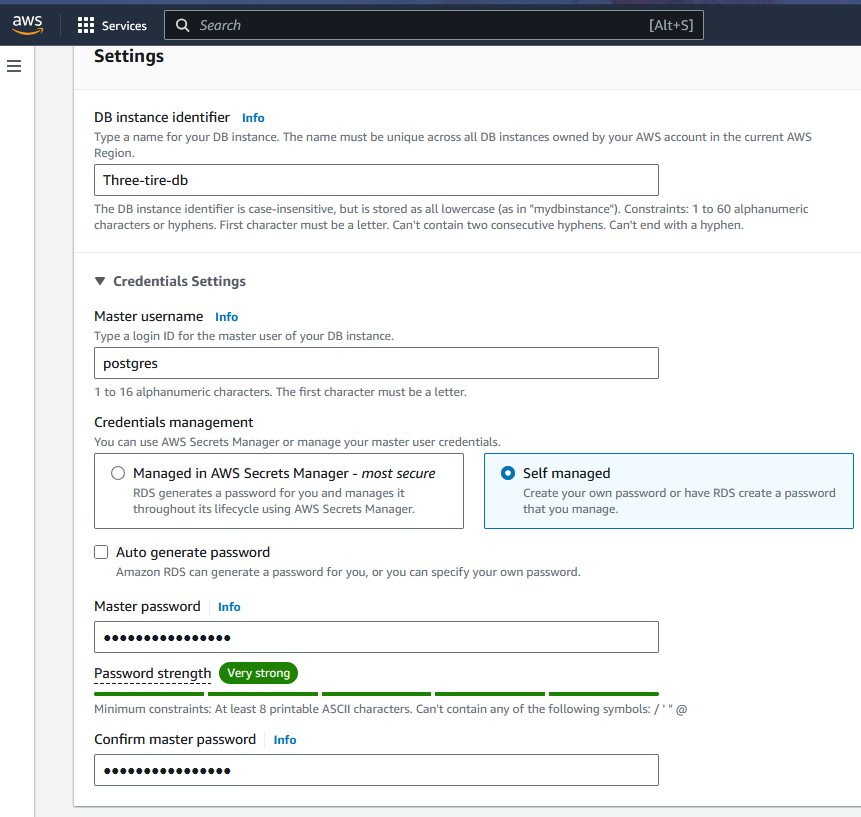

# Three Tire Application 

* * Azure Cloud and Facebook is a single Page Application
* To Develope this single page application we have three major technologies 
    1. Vue js
    2. Anjular js
    3. React js 
* The basic idea is they divide the page into different parts or components and there will be changes in the component the page doesn't reload as such only the components will reload .

# we have an application where fronted is developed in `Vue js` and middle ware is developed in `python` and they develop flask api for that in that they have a database. 

* For setting up Three tire application we have Instruction to run the application on single VM (Virtual Machine) but in organization they use 3 vms for 3 tire application 1st for Fronted where Web is visible, 2nd for backend where Api is present and 3rd for Database.


* Search for RDS service in AWS console 

* For Running the application you need Database and 1 Vm and Search for RDS service in AWS console 
     1.  First we need  Database in AWS `AWS RDS` then create a database go with postgres Database and  garden.md is the file where the configuration of the data base is present.


*    2.  We need to configure PostgreSQL Database with AWS cloud and should be in the same region and we require follow below images instruction which is present in dockerfile  
    

*    3. Python to be installed on VM
*    4. NodeJs Version 10 

# Creating PostgreSQL Database in AWS

* Search for RDS service in AWS console
 

* Now create Database and select `standard create` database
 

* Select PostgreSQL Engine Version and for now select Free tier as a Template

 

* # Templates (Choose a sample template to meet your use case.)
   1. select PostgreSQL Engine Version and for now select Free tier as a Template
  
   2. In Settings section provide your Database instance identifier name and create your credentials for Master user
   3. provide master username and enter password for master user 
  

# Instance configuration
   1. Select storage type and storage allocation as per requirement and i don't need autoscaling so unmark it
  

# Connectivity  Info
   1. select your Virtual Private Cloud (VPC)
   2. select DB subnet group
   3. for now select Public access as Yes 
   4.  PostgreSQL the default port number is set to 5432 
   5.  select security group which has required permissions
    
    
   6. Select the Availability Zone
     

# Database authentication
   1. i have set password authentication 
   
   2. create database now
      
    
   
--------------------------------------------------------------------------------------------------------------------
# Part 2

* Now lok at a `api` part so this is a very simple application and i want to run this application. so let me get the code where it is present. `Garden io` 
  
   1. Now we have to create EC2 in same region to host the application 
      
     
   2. Login into machine in terminal  `ssh ubuntu@(your vms ip address)`
      
   3. we need python and we get the Python pre-installed.
      

   4. Git clone the application: 
      `git clone https://github.com/paswan1995/threetireapp.git`
      * python3 runs Python code, and pip3 installs Python packages for Python 3.

   1. Install the python pip package
     `sudo apt install python3-pip -y`
   2. This command is used to create a virtual environment in Python. 
      `python3 -m venv .venv`  
   
   3. This command  is used to install the virtualenv package using pip, the Python package manager.
      `pip3 install virtualenv` 
   
   4. This commands you provided are used to install Python 3.12 and its associated venv module on an Ubuntu system
     ```
      sudo add-apt-repository ppa:deadsnakes/ppa
      sudo apt update
      sudo apt install python3.12 python3.12-venv`   
     ```
    
   
   5. The command  is used to install development headers and libraries for Python 3 and PostgreSQL on an Ubuntu Now install the binary required to run the application (search this: installing vertualenv in ubuntu to install)
     ``sudo apt-get install -y python3-dev libpq-dev``
   
   6. Install the NVM (Node Version Manager) 
      `curl -o- https://raw.githubusercontent.com/nvm-sh/nvm/v0.39.1/install.sh | bash` 
      
   
   7.  Make sure to check for the latest version of NVM on its GitHubRepository  and replace v0.39.1 with the latest version if necessary.
   
   8.  Activate NVM : After the installation script runs, you need to activate NVM. You can do this by either closing and reopening your terminal or running:   
      `source ~/.bashrc`

   9.  Verify NVM Installation : To confirm that NVM has been installed correctly, check the version:
     `nvm --version`
    
   
   10. The command is used to install all the Python packages listed in a file named requirements.txt. This is commonly used in Python projects to manage dependencies.
    `pip3 install -r requirements.txt`   
    
    
   11. The command is used to run a Python script named app.py using Python 3.
       `python3 app.py`
      

   12. This commands are setting environment variables for connecting to a PostgreSQL database. The command connects to a PostgreSQL database using the psql client: or you can connect with GUI using App called `Azure data studio`
    ```
     psql --host=postgres-db.ch0uy20yozxm.ap-south-1.rds.amazonaws.com --dbname=postgres-db --username=postgres-db
    ```
    *  or 

    
    
    
    
    * Azure Data Studio 
    
    

  13.  These environment variables are typically used by applications or database tools to connect to the specified PostgreSQL database without requiring the credentials to be entered manually each time.
   
    ```
    export PGHOSTNAME='db-ma.ch0uy20yozxm.ap-south-1.rds.amazonaws.com'
    export PGDATABASE='db-ma'
    export PGPASSWORD='postgres'
    export PGUSER='postgres'
    ``` 
    * The command npm run serve is typically used to start a development server for a project. This command usually triggers a script defined in the package.json file under the scripts section.
    * `npm run serve`
  14. is the voting web is working or not check now
   
   
   