Setting Up Three Tier Application
----------------------------------
* For setting up three tier application one need to manage 3 domains
    1. Data Base
    2. Api (Backend)
    3. Web (Frontend)
## Data Base
* Create Postgres Data Base in AWS and give credentials
* `garden.md` is the file where the configaration of the data base is present.
* 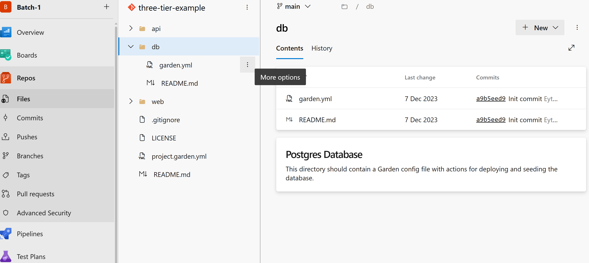
    ### Credentials that are given when creating data base
    * ```
        # To create the Table add the following command to the postgres data base
        CREATE TABLE IF NOT EXISTS votes (id VARCHAR(255) NOT NULL UNIQUE, vote VARCHAR(255) NOT NULL, created_at timestamp default NULL)
      ```
    * 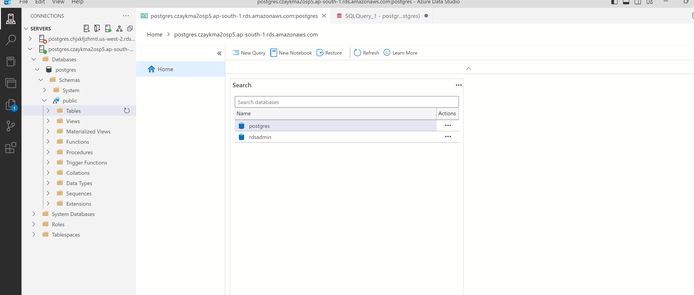
    * 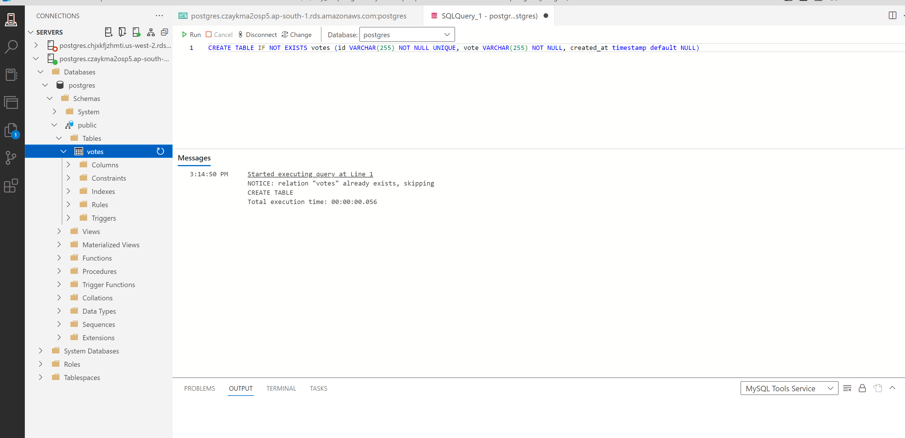
    
* 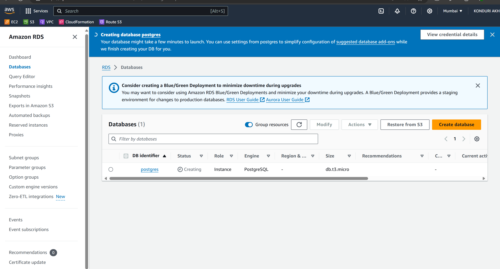
    
## Api(Backend)
* First see the configaration files
* 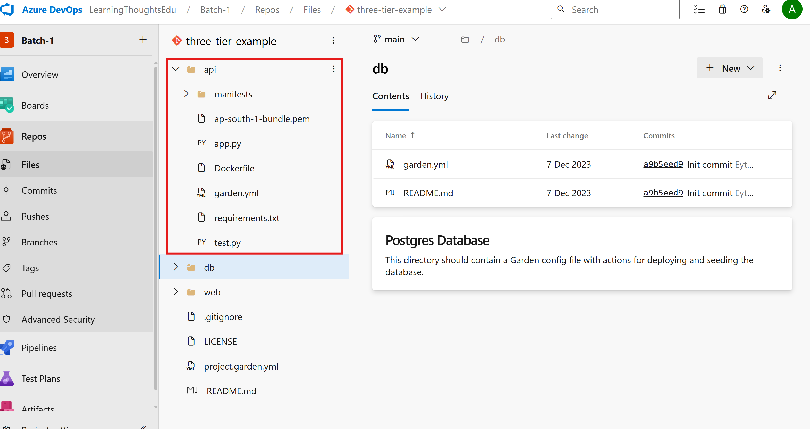
  * ### Set the environmental variables as below
    * ```
    export PGHOSTNAME='host_name_of_data_base' \
    export PGDATABASE='postgres' \
    export PGPASSWORD='akhil123' \
    export PGUSER='postgres' 
    ```

* Clone the application into Ubuntu Machine
* Add Environmental variables as mentioned below
```
# Clone git repository
git clone https://LearningThoughtsEdu@dev.azure.com/LearningThoughtsEdu/Batch-1/_git/three-tier-example
# Get into api folder
cd three-tier-example/api/
# Checking python version
sudo python3 --version
# Installation of Pip
sudo apt install python3-pip -y
# Installing venv in machine
sudo apt install python3.12-venv
# Creating virtual environment
python3 -m venv .venv
# Activate the environment
source .venv/bin/activate
     # Adding postgres dev
     sudo apt update
     sudo apt install postgresql-dev musl-dev gcc -y
# Installing necessary libraries
sudo apt-get update
sudo apt-get install libpq-dev -y
# Installing the requirements
pip3 install -r requirements.txt
# Execute the following command to run the api server
gunicorn app:app -b 0.0.0.0:8080 --log-file - --access-logfile - --workers 4 --keep-alive 0
or 
python app.py
```
## Web (Frontend Setup)
* Execute the following commands
* 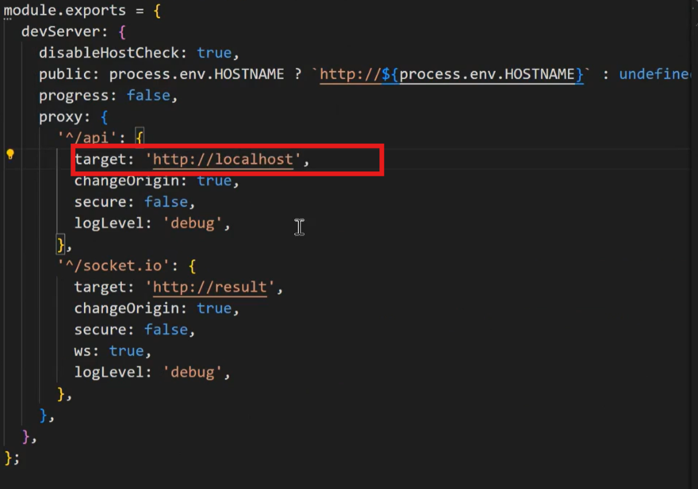
* If necessary add the following environmental variable for the api server url
* 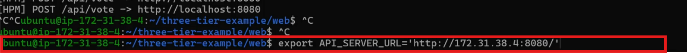
```
# Install node version manager(nvm)
sudo apt install
sudo apt install curl
curl -o- https://raw.githubusercontent.com/nvm-sh/nvm/v0.39.3/install.sh | bash 
source ~/.bashrc
nvm --version
# Installing nodejs 10
nvm install 10
node --version
npm --version
# Installing necessary packages
npm install
# Run the following command to run the frontend work
npm run server
```
* 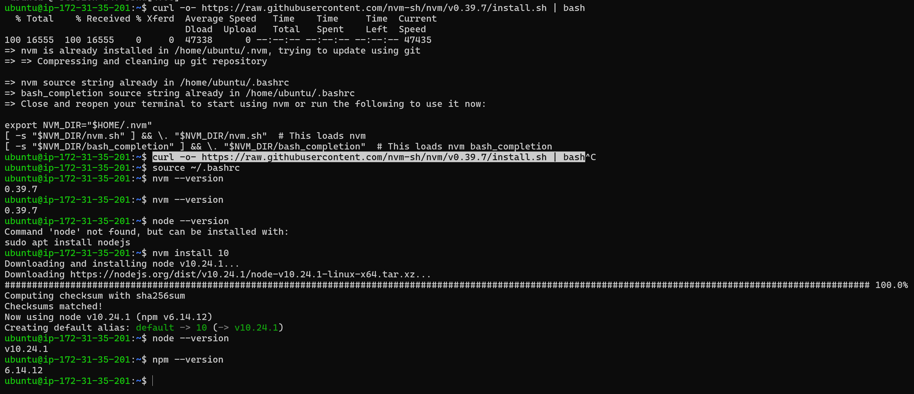
* 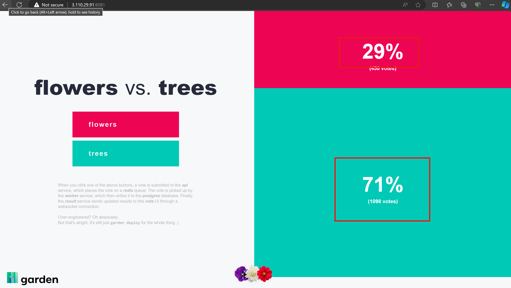
* 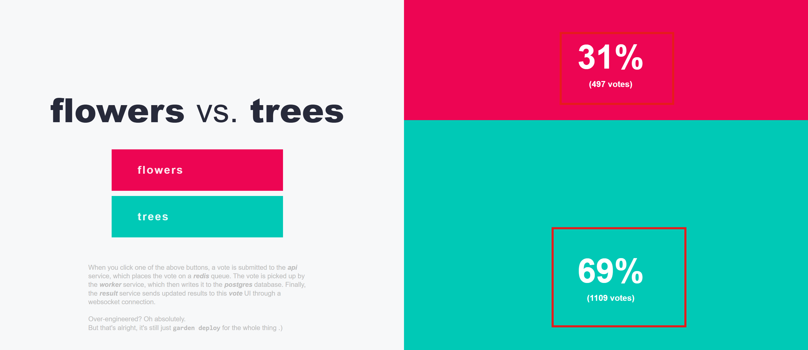
* 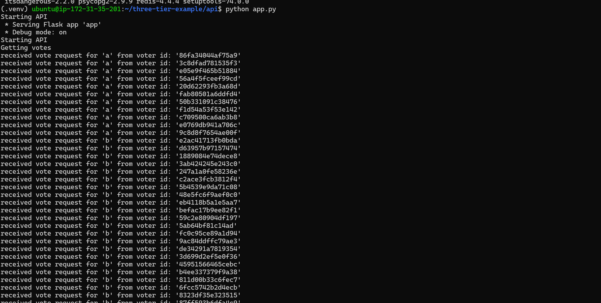
* 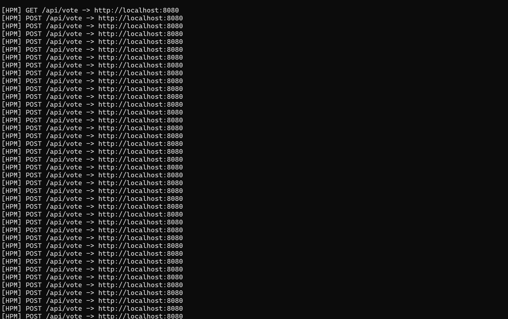